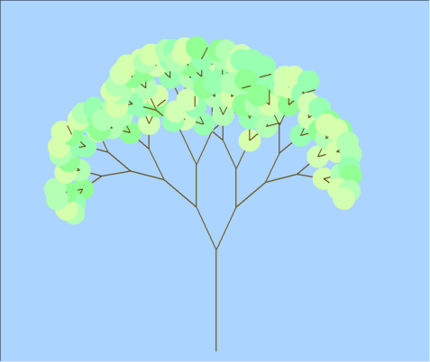
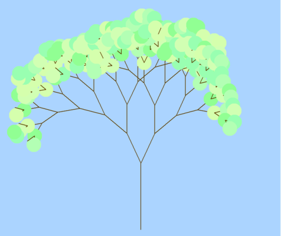
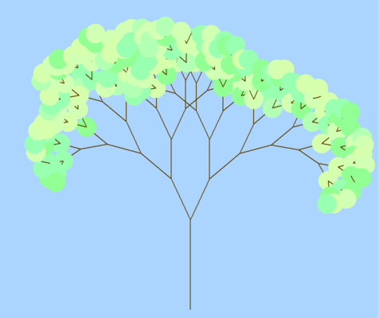
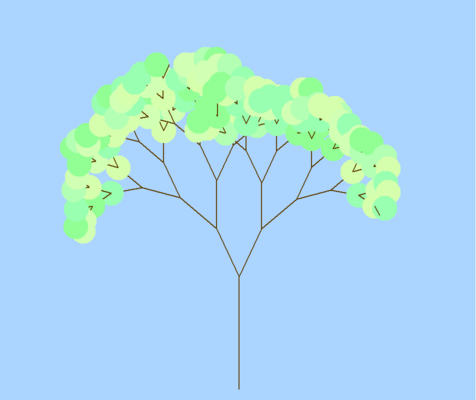
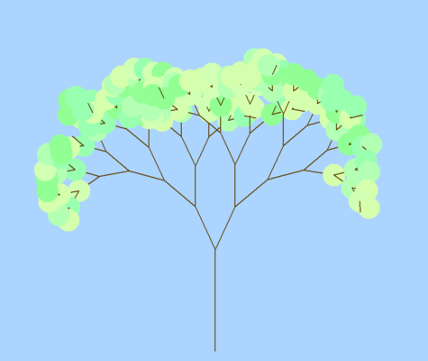

# Recursive Tree Generator

## Table of contents
* [Overview](#overview)
* [Examples](#examples)
* [Technologies](#technologies)
* [Setup](#setup)
* [Limitations](#limitations)

## Overview
Given the size of the tree, a recursive tree is generated. Each tree is unique because the length of each branch is randomized, as well as the colours of the leaves. The result is a full tree where each branch has either exactly two or exactly zero children. The recursion follows an *inorder* pattern for generating the trees.

## Examples
### Screenshots of Turtle Python Graphics GUI

> Five different trees procedurally generated

## Technologies
- **Python 3.8**
- **turtle**
  - For drawing the graphics

## Setup
To run this project, clone the repository and run the Python file.

    python makeTree.py

## Limitations
- [ ] The image does not scale to the size of the window
  - if the window is too small it must be resized to view the full picture

## License
Licensed under the [MIT License](LICENSE).
